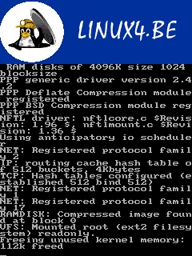
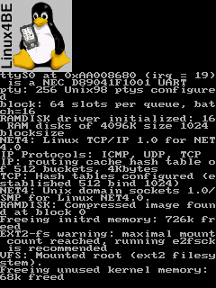

# be300-framebuffer

Casio BE-300 (NEC VR4131 MIPS little-endian) emulator based on the Unicorn engine.

## Screenshots

### Kernel 2.6


### Kernel 2.4


### WinCE 3.0


## Project Overview

This project is an emulator for the Casio BE-300, a MIPS-based PDA. It uses the Unicorn engine for CPU emulation and provides support for various hardware peripherals and kernels.

### Supported Kernels
- **Linux 2.6.8.1**: Booted to userspace.
- **Linux 2.4.18**: Known good kernel and ramdisk.
- **Windows CE 3.0/4.0**: Support for NAND boot and SPL bootloader.

## Development

### Build and Test (Docker)
```bash
docker compose build mips-dev
docker compose run --rm mips-dev /bin/bash
# Inside container:
mkdir build-docker && cd build-docker
cmake ..
make
```

### Running Linux 2.6
```bash
./be300 --kernel ../kernels/vmlinux-2.6
```

### Running Windows CE
```bash
./be300 --nand ../ce/restore_images/All_nand_300.bin
```
