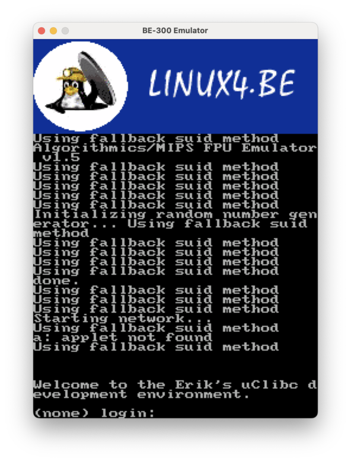
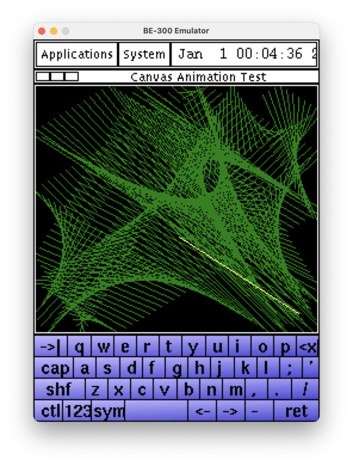
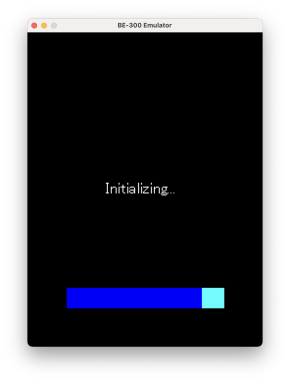

# be300 emulator

Casio BE-300 (NEC VR4131 MIPS little-endian) emulator using a modified fork of
the [GXemul](http://gavare.se/gxemul/) 0.7.0 CPU engine. The emulator boots
Linux 2.4, 2.6, and 4.2.9 kernels to userspace, and cold-boots Windows CE 3.0/4.0
from a real 16KB boot ROM dumped from hardware.

Available as a native desktop app (macOS, Linux), a
[web app](https://linux4be.com), and mobile apps for Android and iOS.

## Screenshots

### Kernel 2.6


### Kernel 2.4 vmlinux-pgui-demo


### WinCE 3.0


## Supported Kernels

| Kernel | Version | Notes |
|--------|---------|-------|
| `vmlinux-pgui-demo` | Linux 2.4.18 | Known good kernel and ramdisk (PicoGUI demo) |
| `vmlinux` | Linux 2.4.18 | Statically linked, not stripped |
| `vmlinux-mw` | Linux 2.4.18 | |
| `vmlinux-pgui-test1` | Linux 2.4.18 | |
| `vmlinux-pgui-fbtest` | Linux 2.4.18 | Framebuffer test |
| `vmlinux_sdlregtest` | Linux 2.4.18 | SDL register test |
| `vmlinux-qte` | Linux 2.4.18 | Qt/Embedded |
| `vmlinux-2.6` | Linux 2.6.8.1 | Use `--sfb-5bit-green` for correct colors |
| `vmlinux-4.2.9` | Linux 4.2.9 | Multi-page userspace support |

All kernels boot to userspace on both real hardware and the emulator. The 2.4
kernels use `--cmdline` for boot parameters; the 2.6 kernel ignores `--cmdline`
(hardcoded command line in prom_init).

## WinCE NAND Images

| Image | Version | SPL |
|-------|---------|-----|
| `All_nand_300.bin` | WinCE 3.0 | v0.52 |
| `org_CE_30.bin` | WinCE 3.0 | v0.60 |
| `BE500.bin` | BE-500 variant | v0.62 |
| `CE_Net.bin` | WinCE 4.0 | v0.62 |

WinCE boots via cold boot from the ROM reset vector (0xBFC00000). The ROM reads
NAND, loads the SPL bootloader, SPL decompresses NK.exe into RAM, then the ROM's
boot dispatcher hands off to the WinCE kernel.

## Prerequisites

- CMake 3.10+
- C11 compiler (GCC or Clang)
- SDL2 (optional -- builds headless without it)

## Building

```bash
git clone --recurse-submodules <repo-url>
cd be300-framebuffer
mkdir -p build && cd build
cmake ..
make -j$(nproc)
```

If you already cloned without submodules:
```bash
git submodule update --init
```

## Usage

```
Usage: be300 [options] [rom.bin]

Options:
  --kernel <vmlinux>    Load ELF kernel directly
  --cmdline <string>    Kernel command line passed via bootinfo
  --nand <image>        Boot WinCE from NAND dump (B000FF SPL loader)
  --sfb-5bit-green      Use 5-bit green expansion for 2.6 sfb.c
  --ram <file>          Preload a raw RAM image at PA 0x00000000
  --sdram <MB>          SDRAM size in megabytes (default: 16)
  --speed <mhz>         Target CPU MHz (default: 166 = real hardware, 0 = unthrottled)
  --trace               Print each executed instruction to stderr
  --log-mmio            Log all MMIO register reads/writes
  -h, --help            Show this help
```

`--kernel`, `--nand`, and a positional ROM image are mutually exclusive.

### Running Linux 2.4

```bash
./be300 --kernel ../kernels/vmlinux-pgui-demo \
  --cmdline "console=tty0 root=/dev/ram"
```

### Running Linux 2.6

```bash
./be300 --kernel ../kernels/vmlinux-2.6 --sfb-5bit-green
```

### Running Windows CE

```bash
./be300 --nand ../ce/restore_images/All_nand_300.bin
```

### Building a Linux-booting NAND image

`tools/build_nand_linux.py` packages a Linux ELF kernel into a 16 MB NAND image
that boots through the stock masked boot ROM, with no modifications to ROM,
SPL, or emulator. **This has only been verified in the emulator — it has NOT
been tested on real hardware.** In principle it could be flashed via
`NANDWRITER.bin` (written to CF card as `All_nand.bin`), but that path is
unverified and may fail for reasons the emulator doesn't exercise (NAND ECC,
OOB layout, actual ROM timing, etc.).

```bash
# Build the image
python3 tools/build_nand_linux.py \
  --kernel kernels/vmlinux-pgui-demo \
  --cmdline "console=tty0 console=ttyS0,9600 root=/dev/ram" \
  --output linux_nand.bin

# Test in the emulator (use --speed 0 so the MIPS16 ROM loader doesn't
# dominate wall-clock time — see note below)
./build-host/be300 --nand linux_nand.bin --speed 0
```

Options:
- `--kernel <elf>`: Linux ELF32 MIPS LE kernel (kernels with embedded ramdisks work best).
- `--cmdline "..."`: kernel command line (passed via argv[1], same format as `--kernel`).
- `--output <file>`: 16 MB output image.
- `--kernel-name <name>`: string used as argv[0] (default `vmlinux`).
- `--entry-override 0x...`: override the kernel entry point from the ELF header.
- `--no-bootinfo`: skip argv/hpc_bootinfo setup (for 2.6 kernels whose `prom_init` ignores bootloader args).

How it works:

1. **ROM → B000FF → stub → kernel chain.** The tool writes the kernel as a
   large B000FF record stream into an expanded partition 1. The ROM's native
   MIPS16 B000FF walker loads every record into RAM, then jumps to a tiny
   (~84 byte) MIPS32 bootstrap stub.
2. **Stub relocates + jumps.** Kernel segments are loaded to a temporary
   address (`kernel_va + 0x200000`) so the B000FF walker doesn't overwrite
   the ROM's own stack at PA 0x3800 mid-load. The stub then memcpys the
   kernel to its real link address, sets `$a0`/`$a1`/`$a2` with argc / argv /
   `hpc_bootinfo`, and jumps to the kernel entry point. It never returns to
   ROM, so the ROM's WinCE-specific post-load handoff (section copier,
   callback registrar) never runs.
3. **Single-partition layout.** Partition 1 is expanded to cover the full
   B000FF image (SPL + kernel + bootinfo). Partitions 2/3 are unused.

**Emulator vs real hardware speed:** The ROM's MIPS16 loader runs through
GXemul's MIPS16 slow interpreter (no dyntrans). Loading a ~2 MB Linux image
takes **1–3 minutes of wall time** even at `--speed 0`, because the loader has
to process ~4500 NAND pages through the interpreter. On real hardware this is
instant. Use `--speed 0` and **wait for the kernel to boot** — you'll see black
fb and empty stdout for the entire load phase, then kernel serial output and
framebuffer console once the stub hands off.

## Cross-Development Toolchain (Docker)

A Docker container provides MIPS cross-tools for analyzing kernels and WinCE
binaries:

```bash
docker compose build mips-dev
docker compose run --rm mips-dev /bin/bash
```

Includes `mipsel-linux-gnu-*` (Linux ELF) and `mipsel-pe-*` (Windows CE PE)
toolchains.

## Forum Scraping

The repo includes a Playwright-based browser scraper for `be300.org` forum
research. It is intended for collecting board and topic HTML snapshots when the
site is reachable in a normal browser but blocks plain HTTP clients.

By default it now archives all discovered boards and all discovered thread
pages. The `--max-*` flags are optional caps for sampling or debugging.

Install the dependency and Chromium once:

```bash
npm install
npx playwright install chromium
```

Run the scraper in headed mode by default:

```bash
npm run scrape:be300-forums
```

The scraper now prefers a real local Chrome install when available and reuses a
persistent profile under `build-host/be300_forums/profile/`. That gives
Cloudflare a better chance of treating the session like a normal browser and
lets any successful challenge solve persist across reruns.

Useful flags:

- `--connect-cdp <url>` to attach to a manually opened Chrome session instead of launching one
- `--browser auto|chrome|chromium` to force the browser channel
- `--profile-dir <dir>` to change the persistent browser profile location
- `--headless=false|true` to switch between interactive and headless runs
- `--max-boards <n|all>` to cap how many boards are visited
- `--max-topics-per-board <n|all>` to cap how many topics are crawled per board
- `--keywords <csv>` to retune ranking toward specific hardware or boot terms
- `--out <dir>` to change the output directory

Example:

```bash
npm run scrape:be300-forums -- \
  --browser chrome \
  --headless=false \
  --max-boards 5 \
  --max-topics-per-board 8
```

Outputs are written under `build-host/be300_forums/` by default:

- `boards.json` with discovered boards plus every saved board page
- `topics.json` with discovered topics plus every saved thread page
- `pages/` with raw HTML snapshots and the initial index screenshot
- `storage-state.json` with the browser session state for reruns

### Manual Chrome Attach

If Cloudflare keeps reloading when Playwright launches the browser, use a
manually opened Chrome session and attach to it over CDP instead:

```bash
/Applications/Google\ Chrome.app/Contents/MacOS/Google\ Chrome \
  --remote-debugging-port=9222 \
  --user-data-dir=/tmp/be300-forum-chrome
```

Then use that Chrome window normally:

1. Open `https://www.be300.org/forums/index.php?action=forum`
2. Attempt the Cloudflare challenge manually
3. Leave the browser running
4. In another terminal, attach the scraper:

```bash
node tools/scrape_be300_forums.js --connect-cdp http://127.0.0.1:9222
```

This mode avoids Playwright launching the browser itself and gives the site a
more normal interactive session to inspect.
